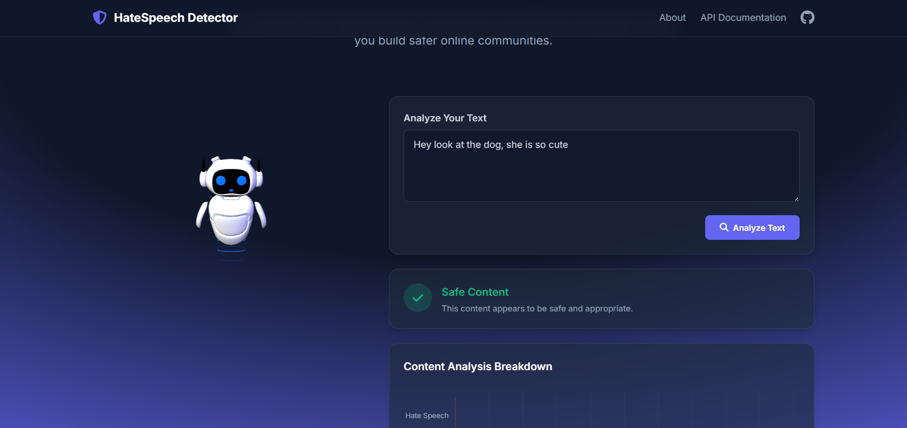

<!-- Python 3.13.5 -->


# Hate Speech Detection API



A powerful Flask-based API that detects Deep Fake, hate speech, Scams and False info in images and text using machine learning. The API supports real-time analysis, multiple languages, and provides alternative suggestions for toxic words. Gives probability

## Features

- 🔍 Real-time DeepFake, hate speech, Scams & False info detection
- 🌐 Multi-language support with automatic translation
- 💡 Alternative word suggestions for toxic content
- 🔑 API key authentication with tiered access
- ⚡ WebSocket support for real-time analysis
- 🔒 Rate limiting based on API tier

## Tech Stack

- **Backend Framework**: Flask
- **Machine Learning**: TensorFlow, NLTK, Pytorch, transformers
- **Real-time Communication**: Flask-SocketIO
- **Language Detection**: langdetect
- **Translation**: googletrans
- **Deployment**: Universal

## Installation

1. Clone the repository:
```bash
git clone https://github.com/akhilroyal2033/Combating_Online_Threats.git
cd Hate-Speech
```

2. Create a virtual environment and activate it:
```bash
python -m venv venv
source venv/bin/activate  # On Windows: venv\Scripts\activate
```

3. Install dependencies:
```bash
pip install -r requirements.txt
```

4. Download required NLTK data:
```python
python -c "import nltk; nltk.download('punkt')",
python -c "import nltk; nltk.download('punkt_tab')"
```

## Environment Setup

Make sure you have the following environment variables set:
- `PORT`: The port number for the application (default: 5000)

## API Usage

### Authentication

All API endpoints require an API key passed in the Authorization header:
```
Authorization: Bearer your-api-key
```

### Endpoints

1. **GET /** - Home page
2. **GET /api-docs** - API documentation
3. **POST /api/create-key** - Create a new API key
4. **POST /analyze** - Analyze text for hate speech

### WebSocket Events

- `analyze_text` - Send text for real-time analysis
- `analysis_result` - Receive analysis results
- `analysis_error` - Receive error messages

## API Tiers

- **Free**: 100 requests/day
- **Basic**: 1,000 requests/day
- **Premium**: 10,000 requests/day
- **Enterprise**: Unlimited requests

## Contributing

Contributions are welcome! Please feel free to submit a Pull Request.

akhilroyal2033@gmail.com
Akhil Royal
